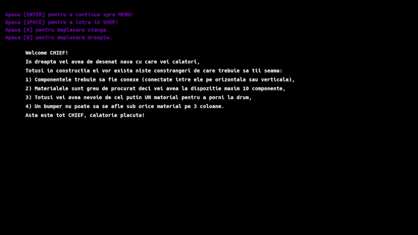
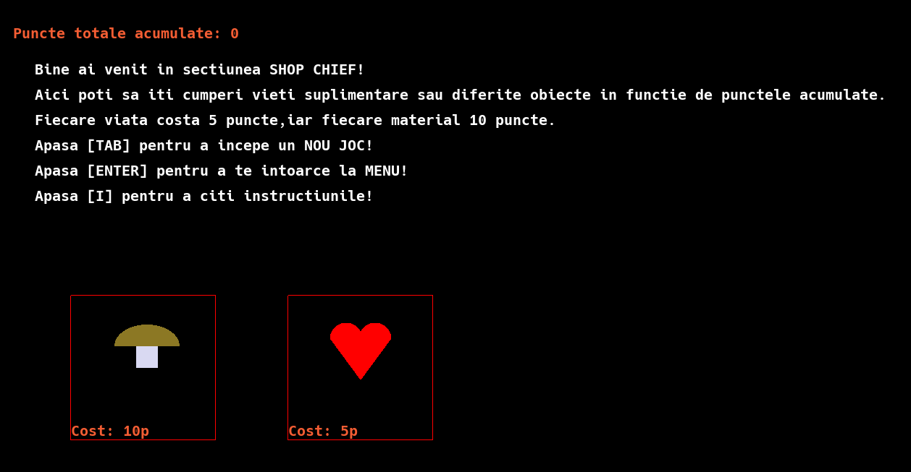

# 🎮 Breakout Basic

Un joc 2D simplu inspirat din clasicul **Breakout**, care implementează mecanici de bază precum ricoșeul mingii, sistem de vieți și un shop pentru upgrade-uri.

---

## 🎥 Demo

<p align="center">
  
</p>

---

## 🛒 Shop

<p align="center">
  
</p>

În shop poți achiziționa diferite elemente care îți influențează gameplay-ul:

- 🟢 **Bumper** – face ca mingea să ricoșeze
- ❤️ **Lives** – adaugă vieți suplimentare peste cele default

---

## 🚀 Gameplay

Jucătorul controlează o platformă și trebuie să mențină mingea în joc pentru a distruge elementele din nivel.

---

## 🧩 Reguli pentru construcția navei

La construirea navei trebuie respectate următoarele reguli:

1. 🔗 Componentele trebuie să fie **conexe** (vertical sau orizontal)
2. 📦 Trebuie să existe **cel puțin o componentă**
3. 🍄 **Bumper-ul (ciuperca)** nu trebuie să fie restricționat de alte componente (deasupra sau dedesubt)

---

## 🛠️ Tehnologii folosite

- Limbaj: *(completează tu, ex: C / C++ / etc.)*
- Grafică: *(dacă ai folosit ceva – SDL, OpenGL etc.)*

---

## ▶️ Cum rulezi proiectul

```bash
# exemplu (modifică în funcție de proiect)
make
./breakout
